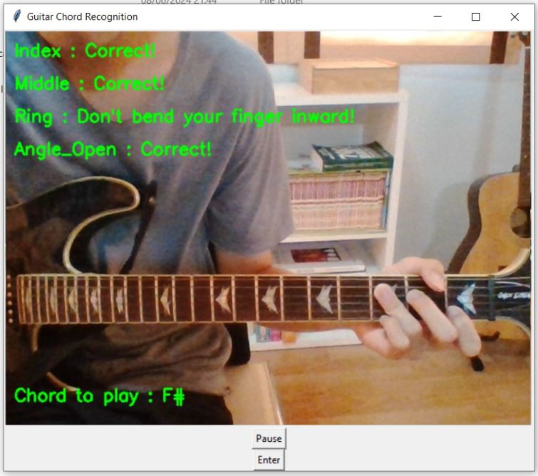

# Guitar fingering and chord detection for beginner
Check your fingering when playing basic chords to see if it is appropriate or not.
# How to use?
Step 1 : Go to this file and click download to your computer

Step 2 : Extract the .zip file and you should see something like this

The .zip file contains all the library and model you need for running the application file.

Step 3 : Run app.exe file. This will take a while and this window will show up.

You should adjust your camera to make it capture your fretboard clearly.

Step 4 : Click 'Pause' button and use your mouse or touchpad to select your fretboard from fret 1-9

Step 5: Click 'Enter' and the real-time prediction will show up like this

If you play the chord correctly from what you see in "Chord to play", the program will be random the different chord for you to play

